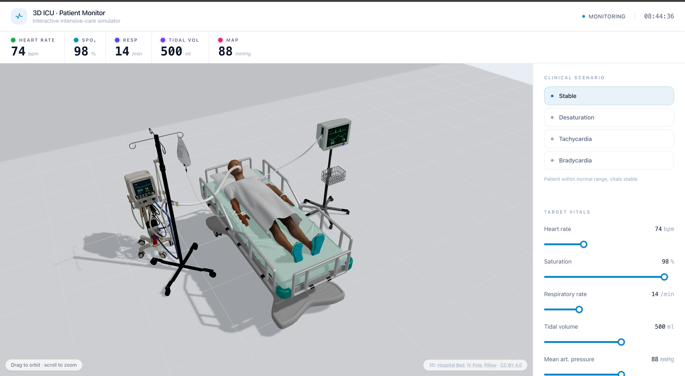

# 3D ICU Patient Monitor

An interactive 3D intensive-care unit (ICU) simulator - a training tool for
medical staff and a demonstration of real-time vital-sign monitoring. The ECG
and SpO₂ waveforms are generated mathematically (no pre-recorded footage), and
the 3D patient turns cyanotic as saturation drops.



## Stack

- **React 19** + **TypeScript** + **Vite** - frontend
- **React Three Fiber** + **drei** + **three.js** - 3D scene
- **Zustand** - vital-signs state

## Getting started

```bash
npm install
npm run dev        # http://localhost:5173
npm run typecheck  # tsc -b (strict, no emit)
npm run build      # tsc -b && vite build → dist/
```

## What's inside

Equipment is a mix of GLB models (bed, IV pole, ventilator, heart monitor,
patient, pillow) with **live data drawn procedurally on top** - every waveform,
the cyanosis tint, the falling IV drop and every tube/cable is generated in
code from the simulated vitals.

| Feature | Where | Math / medicine |
| --- | --- | --- |
| ECG waveform (P-QRS-T) | `lib/ecg.ts`, `scene/Trace.tsx`, `scene/Cardiomonitor.tsx` | Sum of Gaussian curves over the cycle phase; HR drives the period and "compresses" the wave |
| SpO₂ pleth wave | `lib/ecg.ts` | Sine harmonics; amplitude weakens at low saturation |
| Airway-pressure wave | `scene/VentScreen.tsx` | Live ventilator waveform driven by the breath phase |
| Patient cyanosis | `scene/PatientModel.tsx` | Skin material tinted from pink → blue as SpO₂ drops |
| IV drip | `scene/IVStand.tsx`, `scene/Cannula.tsx` | Drop fall integrated from the gravity vector (p = ½·g·t²) |
| Tubes & cables | `scene/Tubes.tsx` | `CatmullRomCurve3` splines, a corrugated tube generator, gravity sag |
| Simulation loop | `scene/Simulation.tsx` | Smooth easing of vitals toward targets (lerp), advancing heart/breath phases |

Screen overlays (ECG/SpO₂ on the monitor, Paw on the ventilator) are computed
onto each model's real screen; GLB models are auto-fitted (scaled/centered/
floored) on load, and the two-pole IV model is trimmed to one pole in-code.

## Controls

- **Right-hand panel** - pick a clinical scenario (stable, desaturation,
  tachycardia, bradycardia) or set vitals manually with the sliders.
- **3D scene** - drag to orbit the camera; scroll to zoom.

## Structure

```
src/
├── App.tsx                     # layout: header + vitals strip + scene + panel
├── types.ts                    # shared types (Vec3, TextMesh)
├── lib/
│   └── ecg.ts                  # ECG / SpO₂ waveform synthesis
├── store/
│   ├── vitals.ts               # vitals state (Zustand) + scenarios
│   └── simClock.ts             # shared phases (mutated per frame, no re-render)
├── components/
│   ├── scene/                  # 3D components (R3F)
│   │   ├── ICUScene.tsx        # Canvas + lights + scene assembly
│   │   ├── Simulation.tsx      # simulation driver (useFrame)
│   │   ├── Room.tsx            # floor + walls
│   │   ├── Bed.tsx             # hospital-bed GLB (auto-fit)
│   │   ├── PatientModel.tsx    # rigged patient GLB + posing + SpO₂ tint
│   │   ├── Pillow.tsx, Cannula.tsx
│   │   ├── Cardiomonitor.tsx   # monitor GLB + live ECG/SpO₂ screen
│   │   ├── VentilatorModel.tsx, VentScreen.tsx
│   │   ├── IVStand.tsx         # IV-pole GLB (trimmed) + drip
│   │   ├── Trace.tsx           # sweeping-cursor waveform
│   │   └── Tubes.tsx           # ET tube, ECG leads, IV line
│   └── ui/                     # Tailwind UI
│       ├── VitalsBar.tsx       # top vitals strip
│       └── ControlPanel.tsx    # scenarios + target-vitals sliders
```

## Notes

- GLB assets under `public/models/` are compressed with **meshopt** geometry +
  **WebP** textures via `gltf-transform` - the
  set went from ~40 MB to ~7.6 MB with no visible quality loss. drei's
  `useGLTF` decodes meshopt out of the box, so no CDN decoder is needed.

## Credits (3D assets)

- **"Hospital Bed"** (https://skfb.ly/oJZ6C) by **Carlos.Maciel** - licensed
  under [Creative Commons Attribution 4.0](http://creativecommons.org/licenses/by/4.0/).
- **"IV Pole"** (https://skfb.ly/6RzEu) by **Mouch** - licensed under
  [Creative Commons Attribution 4.0](http://creativecommons.org/licenses/by/4.0/).
- **"Pillow"** (https://skfb.ly/pFUZn) by **monupaswan944** - licensed under
  [Creative Commons Attribution 4.0](http://creativecommons.org/licenses/by/4.0/).
- Ventilator and patient models were AI-generated with **Tripo**; the
  heart-rate monitor is a third-party GLB.

All live readouts (ECG, SpO₂ and Paw waveforms, digits), the cyanosis tint,
the IV drop and the tubes are generated procedurally in code.
